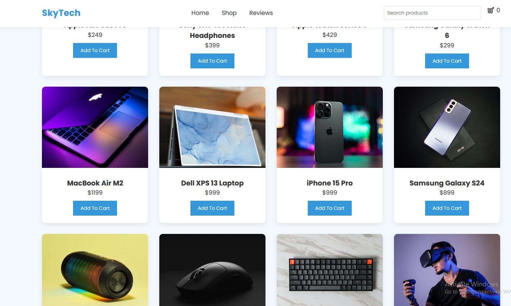

 # 🛒 Local E-Commerce Website

A modern and responsive **Local E-Commerce Website** designed to showcase and sell products through a clean and user-friendly interface. The website allows users to browse products, add items to the cart, and view product details. This project demonstrates core **front-end development** concepts using **HTML, CSS, and JavaScript**.

---

🔗 **Live Demo:** https://devbyfahad.github.io/Local-E-Commerce-Website/

---

## 📌 Features

* 🛍️ Product listing and product cards
* 🛒 Add to cart functionality
* 📱 Fully responsive design
* 🎨 Clean and modern UI layout
* ⚡ Fast and lightweight performance
* 🎯 Built with vanilla JavaScript

---

## 🛠 Technologies Used

* **HTML5** – Structure of the website
* **CSS3** – Styling and layout
* **JavaScript** – Interactivity and cart functionality

---

## 🚀 How to Run the Project

1. Clone the repository

```id="y2ax7v"
git clone https://github.com/DevByFahad/local-ecommerce-website.git
```

2. Navigate to the project folder

```id="y19rqb"
cd local-ecommerce-website
```

3. Open the `index.html` file in your browser.

---

## 📂 Project Structure

```id="inmtl8"
local-ecommerce-website
│
├── index.html
├── style.css
├── script.js
└── README.md
```

---

## 🎯 Purpose of the Project

This project was created to practice and demonstrate front-end development concepts such as:

* Building an **e-commerce style interface**
* Implementing **shopping cart functionality**
* Practicing **DOM manipulation with JavaScript**
* Creating responsive and interactive web pages

---

## 👨‍💻 Author

**Muhammad Fahad**

* GitHub: https://github.com/DevByFahad

---

## ⭐ Show Your Support

If you like this project, consider giving it a **star** on GitHub!

---

## 📸 Local E-Commerce Website

Here’s what it looks like 👇


